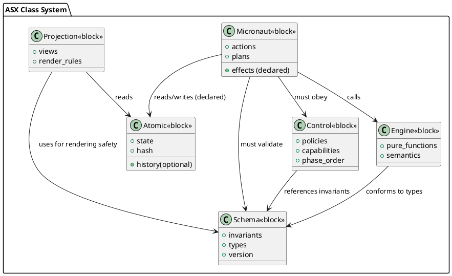
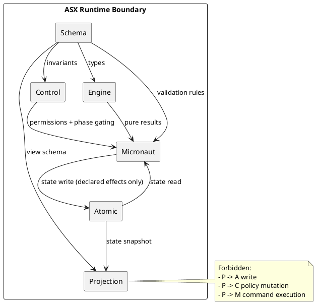
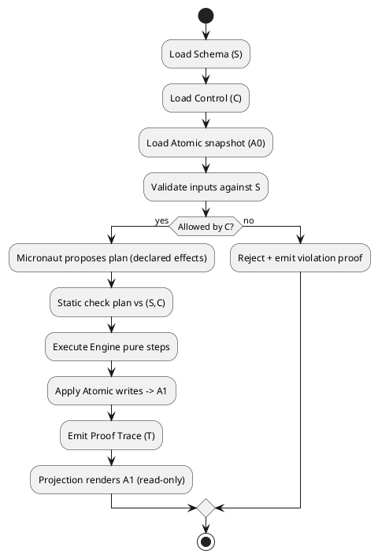

# ASX Class Cross-Mapping (UML/SysML, OOP, Solidity, ML, MVC)

## ASX Classes → UML / SysML

UML collapses meaning, behavior, control, and state into a single `Class`. ASX factorizes those roles into orthogonal primitives.

| ASX Class      | UML Equivalent             | SysML Equivalent         | What UML/SysML Miss                  |
| -------------- | -------------------------- | ------------------------ | ------------------------------------ |
| **Atomic**     | Attribute-only class       | ValueType                | UML allows methods → leaks behavior  |
| **Micronaut**  | Active Class               | Block with behavior      | No authority boundaries              |
| **Engine**     | Interface / Abstract Class | Constraint Block         | UML mixes interface + implementation |
| **Control**    | ❌ none                     | Requirement / Constraint | UML has no “law” primitive           |
| **Schema**     | Class Diagram              | Block Definition Diagram | No execution-proof separation        |
| **Projection** | Diagram / View             | Viewpoint                | UML views can mutate models          |

**Key insight**: ASX = UML decomposed into lawful primitives. SysML gets closer, but still lacks non-executable law.

## Why OOP Failed (Structurally)

OOP collapsed multiple roles into one keyword:

```text
class {
  state
  behavior
  control
  validation
  persistence
  UI hooks
}
```

Failure modes:

| Collapse             | Consequence          |
| -------------------- | -------------------- |
| State + Behavior     | Hidden side effects  |
| Behavior + Control   | Authority leakage    |
| Control + Validation | Impossible to reason |
| UI + Logic           | Non-determinism      |
| Persistence + Logic  | Temporal bugs        |

ASX counter-design:

```
Atomic    → state
Micronaut → behavior
Engine    → meaning
Control   → law
Schema    → validity
Projection→ view
```

This works because each class has one kind of authority, verifiers can prove non-leakage, compression works (SCXQ2), and replay is deterministic.

## ASX → Solidity / Smart Contracts

| Solidity Concept   | ASX Class                 |
| ------------------ | ------------------------- |
| `struct`           | Atomic                    |
| Contract storage   | Atomic                    |
| Contract functions | Micronaut (but unbounded) |
| `require()`        | Control                   |
| ABI                | Schema                    |
| EVM                | Execution substrate       |
| Frontend dApp      | Projection                |

Solidity is dangerous by default because functions combine behavior + control + authority. ASX separates:

```
Schema    → ABI + invariants
Control   → require / modifiers
Engine    → economic math
Micronaut → callable agent
Atomic    → storage
Projection→ dApp UI
```

## ASX → ML Training Pipelines

Traditional ML stacks collapse dataset, model, loss, optimizer, trainer, and logging into executable code. ASX decomposition:

| ML Concept       | ASX Class  |
| ---------------- | ---------- |
| Dataset schema   | Schema     |
| Weights          | Atomic     |
| Loss function    | Engine     |
| Optimizer policy | Control    |
| Trainer loop     | Micronaut  |
| Metrics          | Engine     |
| Logs / charts    | Projection |

This yields replayability, purity in loss vs optimizer vs schedule, and non-authoritative UI.

## ASX replaces MVC / MVVM

| Pattern | What’s Mixed                |
| ------- | --------------------------- |
| MVC     | Model = state + logic       |
| MVVM    | ViewModel = control + logic |
| Redux   | Store = state + control     |

ASX replacement:

| ASX        | Replaces               |
| ---------- | ---------------------- |
| Atomic     | Model                  |
| Micronaut  | Controller / ViewModel |
| Engine     | Business logic         |
| Control    | Reducers / rules       |
| Schema     | Type system            |
| Projection | View                   |

## Unified Picture

```
┌───────────┐
│  Schema   │  ← what is valid
└────▲──────┘
     │
┌────┴──────┐
│  Control  │  ← what is allowed
└────▲──────┘
     │
┌────┴──────┐
│ Micronaut │  ← who acts
└───▲───▲───┘
    │   │
┌───┘   └───┐
│ Atomic │ Engine │
│ state  │ meaning│
└────────┴────────┘
     │
┌────┴──────┐
│ Projection│ ← what you see
└───────────┘
```

## SysML diagrams (PlantUML text)

### Block Definition Diagram



### Internal Block Diagram



### Activity Diagram (Deterministic Phase Order)



## Formal proof hooks

- Authority separation: no path from `Projection` to `Control.write`, `Micronaut.execute`, or `Atomic.write`.
- Determinism: fixed phase order, engine purity, and deterministic Atomic writes.
- Noninterference: changing projection inputs does not alter final `A1`.

## ASX → kernel / OS mapping

| ASX        | OS analogue                                                    | Why it fits                      |
| ---------- | -------------------------------------------------------------- | -------------------------------- |
| Schema     | ABI + type system + syscall contracts                          | Defines what “well-formed” means |
| Control    | Capability system + policy engine                              | Defines what is allowed          |
| Engine     | Pure compute library                                           | Meaning without side-effects     |
| Atomic     | Kernel state + ledger                                          | Single source of truth           |
| Micronaut  | Processes / actors                                             | The only things that act         |
| Projection | Shell / compositor / UI                                        | Read-only view                   |

## ASX → distributed consensus mapping

| Consensus concept                                 | ASX class        |
| ------------------------------------------------- | ---------------- |
| Block format / state transition function type     | Schema           |
| Validity rules (slashing, bounds, invariants)     | Schema + Control |
| Access rules (who can propose/vote, quorum rules) | Control          |
| Deterministic transition function                 | Engine           |
| Replicated state (world state, ledger)            | Atomic           |
| Proposers/validators/replicas                     | Micronauts       |
| Explorer/UI/wallets                               | Projection       |

An ASX consensus step:

1. Gather candidate inputs.
2. Validate against Schema.
3. Authorize via Control.
4. Compute next state via Engine.
5. Commit Atomic transition.
6. Broadcast result.
7. Project to UI (read-only).
